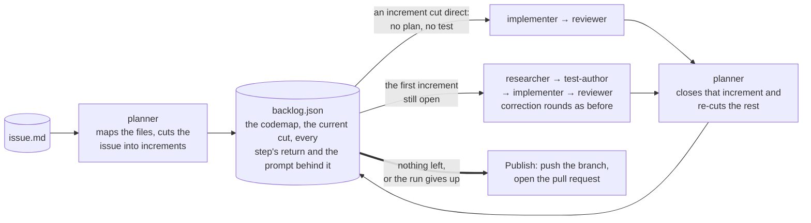
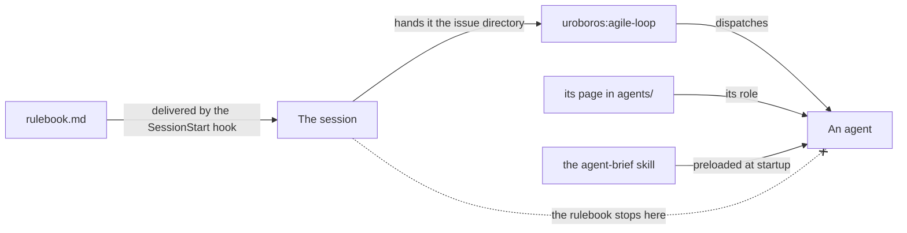
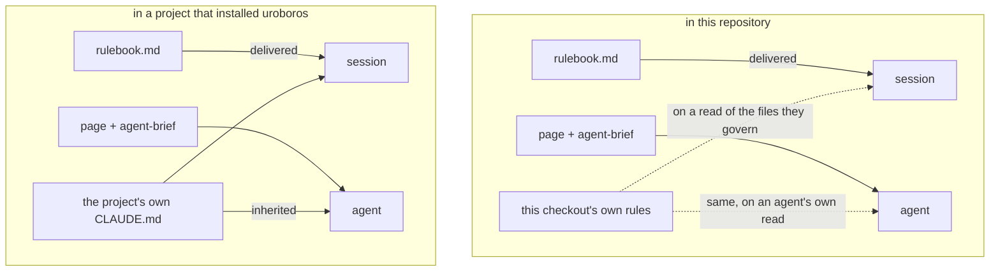

# uroboros

> An AI agent workflow that delegates: the conversation settles what is wanted,
> a scripted loop builds it — research, failing tests, implementation, review,
> correction — and a human steps in only where it matters.

**Uroboros** is the snake that eats its own tail. That is the principle, not
just the name: a run reviews and corrects its own work, and what a run learns
about the workflow is written back into the workflow. It ships as a Claude Code
plugin and assumes a modern Anthropic agent — at least Opus 5. The rules are one
page, [`rulebook.md`](rulebook.md), handed to the session running the work at
its start; this one won't repeat it.

## Context is the scarce resource

A long-running agent gets worse as its context fills with everything it has ever
read. So each step gets its own agent and the smallest brief that does its job:
what a step needs is handed over in writing, what it does not need never
arrives. The chain is cut where a model cannot reliably judge its own work —
grading its own tests, reviewing a diff it just wrote. The session you talk to
is the most expensive context of all, so it never reads the codebase: it settles
the acceptance criteria, writes them to an issue, and hands that issue to a
script.

## The loop corrects itself, and the issue is the record

```mermaid
flowchart LR
    MODE{"An idea —<br/>which mode?"}
    MODE -->|"Direct Mode"| DIRECT["The session does it itself:<br/>read, change, test,<br/>commit, push"]
    MODE -->|"Issue Mode"| CRIT["The session settles<br/>the acceptance criteria"]
    CRIT --> ISSUE[("issue.md<br/>the record of the run")]
    ISSUE ==> OPEN["planner<br/>maps the files, cuts<br/>the backlog"]
    OPEN --> STATE[("backlog.json<br/>the codemap, every step's<br/>return, and the resume point")]
    STATE ==> RES

    subgraph LOOP["one increment of uroboros:agile-loop — one agent per step, each returning a structured object it records into the run state"]
        direction TB
        RES["researcher<br/>writes the implementation plan<br/>and the test plan"]
        TEST["test-author<br/>turns the planned cases<br/>into failing tests"]
        IMPL["implementer<br/>builds until they pass"]
        REV["reviewer<br/>checks the increment's diff"]
        RES --> TEST --> IMPL --> REV
        REV -.->|"findings: correction<br/>round, at most two"| RES
        REV -.->|"every finding a direct fix:<br/>no plan, no test"| IMPL
    end

    REV ==>|"accepted, or<br/>two rounds spent"| CLOSE["planner<br/>closes the increment"]
    CLOSE --> PUB["Publish:<br/>push the branch,<br/>open the pull request"]
    PUB --> MERGE(["A human merges<br/>the pull request"])
    DIRECT --> MERGE
```



The steps are [`researcher`](agents/researcher.md),
[`test-author`](agents/test-author.md), [`implementer`](agents/implementer.md)
and [`reviewer`](agents/reviewer.md), run by a script
([`workflows/agile-loop.js`](workflows/agile-loop.js), which the plugin ships
as the workflow `uroboros:agile-loop`) and not by an agent, because a subagent
cannot start another one. Findings from the
review open a correction round; after two the loop stops and hands back.

A finding says how much of the chain its correction needs. Where the
reproduction already names the file, the line and the right result — a typo, a
stale reference, a wrong number in prose — the reviewer marks it a direct fix,
and a round whose findings are all direct is worked by the implementer alone,
off the findings themselves, with the commands the last round closed. Two agents
instead of four, and the review still runs: the fix is in the diff the next
round judges. That is also why the reviewer never makes the fix itself — its
own edit would reach the pull request unread, and every later round would be
judging a diff it had written into. A remark that leaves every criterion met and
every behaviour unchanged is no finding at all; it goes into the review's
summary and reaches the human through the pull request, costing no round.

Whether, what and how to test is decided once, by the researcher — the only
agent that reads the codebase in depth — in the test plan it returns. The test-author is
given that plan and nothing else about the change, the implementer is given the
implementation plan and never the test plan, and the reviewer is given neither,
so it checks the result against the intent and remains the check on that plan.

The plan also closes the list of commands the change is judged by, and the loop
hands that list to the implementer and the reviewer. Nobody runs a suite or a
linter it leaves out, and an empty list means the review is a reading — so the
cost of checking is a decision made once, with the codebase in view, instead of
four agents each reaching for `test.sh` to be safe. That list binds outside the
sandbox the reviewer builds for another state: inside it the reviewer may write
and run a throwaway probe to prove a doubt it has already stated, and what the
review reports as green or red still rests on the listed commands alone.

Nothing passes between the agents as prose, and nothing passes through the
workflow script. Each agent writes its return once into
`docs/issues/<timestamp>-<slug>/backlog.json`, then commits and pushes it, and
the next role reads it back out of that file: a dispatch prompt names the step
and the fields its agent may see, and carries none of their content. So a plan
is written once rather than emitted twice, and the file the run resumes from and
the brief the live run works from cannot drift apart, because there is only one
of them.

The same rule holds for the rules themselves. A prompt carries what varies with
the dispatch — the increment, the branch, the labels, the commands that count —
and no rule that already has an owner: what binds every agent whatever it was
dispatched for is the shared brief's, and what binds one role is that role's
page. A rule written in two places drifts on the first edit, and the reader
follows whichever copy it saw last.

That file is the single source of truth of a run: start the same workflow on the
same issue directory again and it reads the state's index back, skips every step
already recorded there and carries on from the one that never finished. That is
what makes unattended work possible: idea to pull request with nobody at the
keyboard, and a session picking the work back up hours later resumes from the
state rather than from a conversation that is gone.

What the script itself carries is only steering — the cut, whether tests are
needed, the closed list of commands, how many findings a review filed, and the
questions that end a run — because the workflow runtime gives a script no
filesystem and everything that touches the repository has to go through an
agent. The reviewer is the one role outside all of it: it reads nothing and is
handed nothing any agent produced, because it is the check on them.

## The backlog: the planner says what, the researcher says how

The chain above works one increment. How many increments the issue is — one,
or several — is the [`planner`](agents/planner.md)'s first decision, not the
session's: it opens every run by mapping the files the issue has to change —
the codemap, one line per file with the reason — and cutting the issue into
increments, each with its own acceptance criteria. A backlog of one increment
is a valid cut, and then the chain simply runs once over the whole issue.

The planner builds the codemap by searching the codebase, never by designing
the change: it names files and reasons, and functions, approaches and entry
points stay the researcher's. Every researcher starts its round from that map
instead of touring the repository, and reports where the map was wrong or
incomplete; the planner folds those corrections in when it re-cuts. That is
the division the run is built on: the planner says what — the increments and
the files — and the researcher says how.

The planner also says how deep the chain has to go for each increment: `full`
by default, and `direct` when the criteria and the codemap already name the
file, the place and the right result and no test could catch anything. A
`direct` increment's first round is the implementer and the reviewer alone,
judged by the commands the run's last researcher closed. A correction round
leaves that path, and a second attempt at an increment is always `full`.

After every increment the planner re-cuts the ones still open against what
that increment actually showed — splitting, merging, reordering, sharpening a
criterion the researcher found ambiguous, dropping work that turned out
already done — and updates the codemap the same way. Steering the rest of the
run is the point of the arrangement, not an escape hatch in it.



Each increment is worked on its own branch off the issue branch, and the
planner merges it back when the review accepts it — so the issue branch, and
the pull request, only ever hold accepted work, and a blocked increment's
branch stays unmerged on the remote, named in its note. The reviewer's scope
falls out of that for free: it judges the increment branch against its
merge-base, a diff that carries this increment's work and nothing settled
earlier. Each increment is reviewed on its own: the workflow hands the reviewer
that increment's criteria and names the increments still to come, so unfinished
work reads as scheduled rather than as a finding. Closing an increment ends its
attempt: the steps that got it there move into the increment's `attempts`, where
they stay for whoever reads the run afterwards, and its current steps start empty
so an increment handed back is worked again rather than skipped as recorded.

One field of it is not a record of something finished: an agent announces itself
before it works, so the file names the step in flight, the increment it belongs
to and the prompt it was dispatched with, and drops that the moment the step
records its return. A step runs for minutes to hours, and without it the state
said nothing at all in between — which is what a human watching a run sees.

Nothing in the file is ever deleted, so a finished `backlog.json` is the whole
record of the run — every step return, and the prompt each agent was dispatched
with, verbatim. What keeps that affordable is that reads are addressed rather
than wholesale: `index` for the run's skeleton, `steps` for the returns of the
steps a role names, `codemap` for the map. Nobody in a run ever reads the file
whole, so it is free to grow.

The run stops on its own when the backlog empties, and hands back when it will
not: eight increments spent, one increment worked twice and handed back again
unchanged, or two increments ending with findings open. Either way the branch is pushed and the
pull request says what was delivered and what is still open.

Which mode a task runs in, the human names. **Direct Mode**: the session does it
itself, no issue file and no subagent. **Issue Mode**: the loop above — and for
an idea too vague to write criteria for, the [`grill`](skills/grill/) skill
gets there one question at a time.

## It improves itself

After a run, the [`retro`](skills/retro/) skill reads the session log and
records what got in the way. A rule that keeps misfiring becomes a proposed
change to the rulebook itself, reviewed like any other pull request. Every wired
project loads uroboros fresh at session start, so an accepted fix reaches all of
them with their next session — the workflow gets better at being followed
without a human rewriting it by hand. To have the retros land in *your*
rulebook, fork this repository and point `marketplace add` at the fork.

## Installing it

```bash
claude plugin marketplace add artkoenig/uroboros
claude plugin install uroboros@uroboros
```

A session then gets the subagents, the skills and the `uroboros:agile-loop` workflow
of the current `main`. The plugin pins no version, so every push to `main` is a
new version, and updates come with the next session, not with a
re-installation. The rulebook is a page, and the plugin's SessionStart hook
hands it to the session.

## What reaches whom

Two things carry uroboros into a session, and only one of them reaches an
agent. The rulebook is delivered to the session by the plugin's SessionStart
hook and stops there, for two reasons at once: that hook fires for a session
that is starting, and a subagent is dispatched inside a running one and starts
none; and `rulebook.md` is not a memory filename, so nothing loads it as
project memory and no subagent inherits it that way either. An agent is
assembled from its own page and the shared brief
[`agent-brief`](skills/agent-brief/), both preloaded at dispatch, both shipped
with the plugin.



That is why the rulebook is `rulebook.md` and not a `CLAUDE.md`: a `CLAUDE.md`
here would load as this checkout's project memory and be inherited by every
agent dispatched in it — which no installing project can reproduce. The same
agent would then hold a rule here that it lacks everywhere else.

So the two cases differ in one thing only, and it is not uroboros':



An agent's baseline is identical in both: its page and the brief, and nothing
else uroboros owns. What the host project adds on top is its own memory, and
that is inherited on purpose — an agent should follow the house rules of the
project it is working in.

Those rules — the pages under `.claude/rules/` and `skills/CLAUDE.md` — are for
whoever develops uroboros, and exist in this checkout alone. None of them is in
a startup context, so no subagent inherits one; each arrives instead on a read
of the files it governs, and it arrives for a subagent's own reads exactly as
for the session's. A rule that has to bind an agent *before* it reads anything
therefore cannot live there. It goes into the shared brief, which travels with
the plugin.

## Working in parallel

```bash
claude --worktree feature-auth   # its own checkout under .claude/worktrees/
```

`worktree.baseRef` is pinned to `"fresh"`, so a new worktree branches from the
default branch rather than from unpushed work. Gitignored files a run needs are
listed in
[`.worktreeinclude`](.worktreeinclude) and copied into every new worktree.

## tools/

| Tool                              | Purpose                                                                                                                |
| --------------------------------- | ---------------------------------------------------------------------------------------------------------------------- |
| [`argus`](tools/argus/)           | OpenTelemetry collector for agent sessions: traces, tokens, cost, tool calls, errors. Ingests, aggregates, serves JSON. |
| [`argus-ui`](tools/argus-ui/)     | The page that shows what a collector holds. Local only — started from a checkout, never deployed.                      |
| [`log-parser`](tools/log-parser/) | Reads a Claude Code or Gemini/Antigravity session log into markdown and metrics. What the `retro` skill runs.           |

```bash
argus start --background                     # collector, http://127.0.0.1:4318
node tools/argus-ui/bin/argus-ui.mjs         # interface, http://127.0.0.1:4319
bin/parse-agent-log --latest auto            # the last session as markdown
```

`argus` is on the `PATH` of every session with the plugin enabled, so any
project can measure itself; the [`argus`](skills/argus/) skill carries the
procedure. It all runs on your own machine — no account, no third-party service.

A run's state gets there on its own: a hook of the plugin follows
`backlog.json`, so every write an agent makes reaches the collector as it
happens. The agents themselves know nothing about it — a run must not change
because someone is watching it — and with no collector configured the hook
reads its input and stops.

## Tests

`bash test.sh` — eight suites, one command: the repository's own rules, what a
parallel run in a worktree needs, the backlog recorder, the run-state hook, the
read barrier, and the three tools.

## Licence

GPL-3.0-or-later — see [LICENSE](LICENSE).
