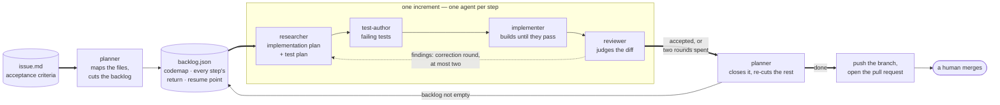

# uroboros 🐍🔁

> Idea in, pull request out. A scripted loop of single-purpose agents plans, tests, builds, reviews and corrects the change — a human only sets the goal and merges.

[](https://code.claude.com/docs)
[](https://www.anthropic.com)
[](./LICENSE)

## 🎯 What is this?

Uroboros is the snake that eats its own tail — that is the principle, not just the
name. A run reviews and corrects its own work, and what a run learns about the
workflow is written back into the workflow. It ships as a Claude Code plugin: five
subagents, one orchestration workflow, four skills, and a one-page
[`rulebook.md`](rulebook.md) handed to your session at startup.

### Key Features

- 🧠 **Context as the scarce resource**: every step gets its own agent and the smallest brief that does its job — nothing else arrives.
- 🔬 **Separation of powers**: the agent that writes the tests never sees the implementation plan, and the reviewer sees neither. No model grades its own homework.
- 🧾 **The issue is the record**: every step writes its return into `backlog.json` — plans, verdicts, and the verbatim prompt behind each one.
- ⏯️ **Resumable**: a run that died mid-flight restarts on the same directory, skips every recorded step and continues from the one that never finished.
- 🧩 **Incremental**: the planner cuts an issue into increments, each on its own branch, and re-cuts what is left after every one.
- 🔁 **Self-correcting**: review findings open a correction round; after two the loop stops and hands back with reasons.
- 🚦 **Cheap paths for cheap work**: a fix that is already fully specified skips research and tests — two agents instead of four, still reviewed.
- 📊 **Measurable**: `argus` collects tokens, cost, tool calls and errors of every session — locally, no account, no third party.
- ♻️ **It improves itself**: the `retro` skill turns friction into a proposed rulebook change, reviewed like any other pull request.

## 🚀 Quick Start

```bash
claude plugin marketplace add artkoenig/uroboros
claude plugin install uroboros@uroboros
```

Then just say what you want:

```text
> Rate-limit the public API to 100 req/min per key. File an issue for it.
```

The session settles the acceptance criteria with you, writes them to
`docs/issues/<timestamp>-<slug>/issue.md`, and starts the loop. It pins no
version — every push to `main` reaches you with your next session.

## 🔄 How it works



Two modes, and you name which one: **Issue Mode** runs the loop above.
**Direct Mode** means the session just does it — no issue file, no subagents.
For an idea too vague to write criteria for, the [`grill`](skills/grill/) skill
gets there one question at a time.

## 🧩 The agents

| Agent                                        | Says                                                            |
| -------------------------------------------- | --------------------------------------------------------------- |
| [`planner`](agents/planner.md)               | *what* — the increments, the files, and when one is done         |
| [`researcher`](agents/researcher.md)         | *how* — the plan, the test plan, and the commands that judge it   |
| [`test-author`](agents/test-author.md)       | the planned cases as failing tests, and nothing of its own        |
| [`implementer`](agents/implementer.md)       | the code, until the closed list of commands is green              |
| [`reviewer`](agents/reviewer.md)             | accepted or not — handed nothing any other agent produced         |

Orchestration lives in [`workflows/agile-loop.js`](workflows/agile-loop.js), not
in an agent, because a subagent cannot start another one. Agents pass nothing to
each other as prose: each writes its return into `backlog.json`, and the next one
reads back exactly the fields it is allowed to see.

## 🛠️ tools/

| Tool                              | Purpose                                                                             |
| --------------------------------- | ----------------------------------------------------------------------------------- |
| [`argus`](tools/argus/)           | OpenTelemetry collector for agent sessions: traces, tokens, cost, tool calls, errors  |
| [`argus-ui`](tools/argus-ui/)     | The page that shows what a collector holds — local only                              |
| [`log-parser`](tools/log-parser/) | Turns a Claude Code or Gemini/Antigravity session log into markdown and metrics       |

```bash
argus start --background                     # collector, http://127.0.0.1:4318
node tools/argus-ui/bin/argus-ui.mjs         # interface, http://127.0.0.1:4319
bin/parse-agent-log --latest auto            # the last session as markdown
```

`argus` is on the `PATH` of every session with the plugin enabled, so any project
can measure itself. A plugin hook follows `backlog.json`, so a live run streams
into the collector — the agents know nothing about it, because a run must not
change because someone is watching.

## ⚡ Working in parallel

```bash
claude --worktree feature-auth   # its own checkout under .claude/worktrees/
```

`worktree.baseRef` is pinned to `"fresh"`, so a new worktree branches from the
default branch rather than from unpushed work. Gitignored files a run needs are
listed in [`.worktreeinclude`](.worktreeinclude) and copied in.

## 🧪 Tests

```bash
bash test.sh   # eight suites: repo rules, worktrees, recorder, hooks, read barrier, tools
```

## 📚 Read more

- [`rulebook.md`](rulebook.md) — the page the session runs by
- [`skills/agent-brief/`](skills/agent-brief/) — the rules every subagent shares
- [`docs/`](docs/) — issues, decisions and the record of past runs

## 📄 Licence

GPL-3.0-or-later — see [LICENSE](LICENSE). Fork it and point `marketplace add` at
your fork to have the retros land in *your* rulebook.
