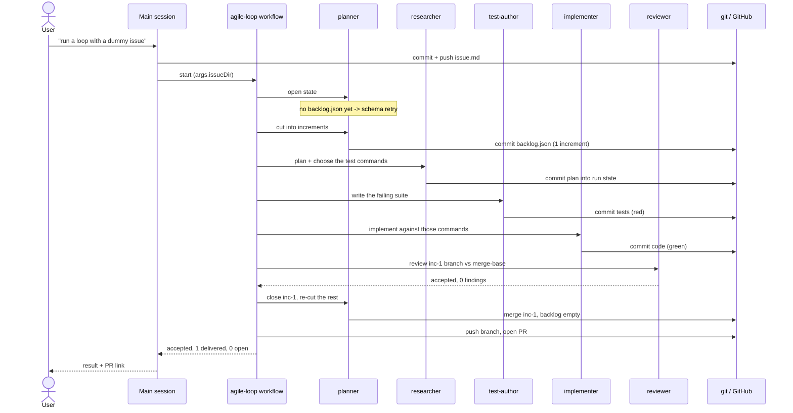

# Dummy issue: a duration formatter

This issue exists to exercise the loop end to end on a small, self-contained
change. Build it exactly as written; do not widen it.

## Goal

Add a helper that turns a duration in milliseconds into a short human-readable
string, and cover it with unit tests.

## Acceptance criteria

- A new module `tools/humanize/duration.mjs` exists.
- It exports a named function `formatDuration(ms)`.
- `formatDuration` returns `"850ms"` for any input below 1000, printed as a whole number of milliseconds.
- It returns `"1.4s"` for any input from 1000 up to but not including 60000, printed with exactly one decimal place.
- It returns `"2m 5s"` for any input from 60000 up to but not including 3600000, printed as whole minutes and whole seconds.
- It returns `"1h 3m"` for any input of 3600000 or more, printed as whole hours and whole minutes.
- It rounds down to the unit it prints, so 1999 becomes `"1.9s"` and 119999 becomes `"1m 59s"`.
- It throws a `TypeError` when the input is not a number, is `NaN`, is infinite, or is negative.
- The module has no dependencies beyond the Node standard library.
- A new test file `tools/humanize/duration.test.mjs` covers one case per rule above, written for `node --test`.
- `test.sh` runs that new test file as its own named suite.
- `bash test.sh` exits 0.

## Out of scope

- No existing file changes beyond the one line that registers the new suite in `test.sh`.
- No caller of `formatDuration` anywhere else in the repository.

## Retro

The run: one increment, cut by the planner from a single-change issue, accepted
by the reviewer with zero findings and zero correction rounds. Eight subagents,
147 tool calls, 21m 22s wall clock, no agent error. What follows is what the
session log, `backlog.json` and the git history show about how that time was
spent.

### Rulebook & Process Friction

**Which process rule or automated hook created disproportionate friction?**
Nothing in the rulebook blocked the run, but the plugin version did: the session
loaded uroboros at `bf8805c195d2` while the repository tip was `f8f14d0`. Every
agent in this run was the stale one, so the run says nothing about the agents
that are actually on `main`. A session cannot swap its plugin mid-flight, so the
warning at session start is the only lever there is — and it fires after the
human has already typed the request.

The one rule that cost real tokens is the recorder's location. Four agents —
the opening probe, the test-author, the implementer and the reviewer —
independently ran `find "$HOME/.claude/plugins" -path '*agent-brief/assets/backlog.mjs'`
before they could record anything. The path is identical for all of them and
known to the workflow that spawns them, yet each rediscovers it. Four searches
plus four `node … --help`-style orientation calls buy exactly one string.

**Where did the agent apply rules too rigidly or incorrectly, causing unnecessary overhead?**
Two places, both in the main session. First, Issue Mode forbids the main agent
to read the codebase, and it read `test.sh` and listed `tools/` and `bin/`
anyway to pick a plausible target for the dummy issue. That was a deviation, not
an emergency: an issue for a brand-new module needs no knowledge of the existing
one. Second, the reviewer is deliberately blind to everything the other agents
produced, and it paid for that blindness here — it spent four greps across
`docs/`, `agents/` and `skills/` re-deriving the repository's suite-doc
convention, which the researcher had already written into the run state one step
earlier. That is the design working as intended, and it is worth knowing what it
costs: roughly a quarter of the reviewer's tool calls.

### Subagent Efficiency & Delegation

**Did delegating to subagents conserve context, or was the briefing overhead larger than the gain?**
It conserved context decisively. The main session finished the whole run on 8
tool calls and 4,563 output tokens; the subagents together burned ~3.35M tokens
of context. Had that work run in the main conversation, the session would have
compacted several times over. For an issue this small the delegation still costs
more end-to-end than doing it directly would have — 21 minutes and eight agent
startups for one module and one test file — but that is the price of the loop,
not a defect in it.

**Were there redundancies or repeated research between the main conversation and subagent runs?**
Yes, and they cluster in two spots.

The planner's codemap did not spare the researcher the same walk. The planner
read `test.sh`, paged `test-repo.sh`, listed `tools/` and grepped for the
`*.test.mjs` / `CLAUDE.md` pairing; the researcher then read `test-repo.sh`
three times in a row, read `test.sh`, listed `tools/` and grepped the same
convention again. That is the single largest redundancy in the run, and it is
the codemap's whole reason for existing.

The push-and-PR step at the end was the most expensive agent of all — 746,580
tokens, 24 tool calls, more than either planner — and it spent that budget
re-reading the run it was closing. It searched the repository for `backlog.mjs`,
read its `--help`, ran `index`, ran `steps` twice, and when `steps` came back
empty it hand-walked `backlog.json` with three ad-hoc `node -e` scripts to find
the step returns under `increments[0].attempts[0].steps`. Everything it dug for
had been returned, in structured form, by the agents the same workflow had just
run.

### Specification & Planning Quality

**Were all critical requirement gaps uncovered upfront during grilling/specifying, or did ambiguities surface late during implementation?**
The criteria held: zero correction rounds, zero findings, nothing parked for the
human. Two gaps still surfaced late, both minor and both correctly ruled out of
scope rather than silently fixed. The issue never bounded the input at the top
end, so above ~1e21 ms the hours field prints in exponential notation and no
criterion covers it. And the issue did not know about the repository's own rule
that every directory holding a `*.test.mjs` carries a `CLAUDE.md` suite doc —
the planner found it while building the codemap and folded it into the
increment's criteria, which is exactly where it should have been caught.

**Was the architecture plan strictly followed, or were there unauthorized deviations?**
Strictly. The diff is six files, the out-of-scope rules held — `test.sh` gained
one suite entry and nothing else changed, and no caller of `formatDuration` was
added anywhere. The reviewer noted that the README tool table still omits
`humanize` and left it alone because the issue forbade touching it. An agent
declining to be helpful beyond its brief is the behaviour worth having.

### Token & Latency Optimization

**Where did token spikes, redundant tool loops, or uncompacted outputs occur?**
The spike is the final push-and-PR agent at 746,580 tokens — 22% of all subagent
context for a step that pushes a branch and opens a PR. Its `steps`-returns-empty
detour is the loop to kill. The second spike is the researcher at 474,508, and
three consecutive full reads of `test-repo.sh` are a visible part of it. The
opening probe wasted a whole retry round on a schema mismatch after its
`backlog.mjs index` call exited 1 on a `backlog.json` that does not exist yet —
which is the normal state at the start of a run, not an error.

**How efficient was context cache utilization across steps?**
Excellent in the main session: 496,603 cache-read against 60,093 cache-creation
tokens, an 89% hit rate across four steps. Each subagent, by contrast, pays its
own cache-creation cost on startup — between 27,512 and 54,665 tokens, ~297k
across the run — because every agent boots a fresh context with the agent brief
and its role page. That is the fixed toll on the eight-startup design.

### Tooling & Automation Opportunities

**Which recurring manual steps should be encapsulated into dedicated CLI tools or scripts?**
Four, in the order they would pay off:

1. Put the absolute path of `backlog.mjs` in the agent prompt. Four `find`
   sweeps over `~/.claude/plugins` disappear.
2. Make `backlog.mjs steps <file> <increment>` return the step returns that are
   actually there. Today it reports empty while the data sits in
   `increments[0].attempts[0].steps`, and the most expensive agent in the run
   hand-parsed JSON around it.
3. Give the recorder a replan write path. The closing planner fell back to
   `python3` heredocs against `backlog.json` in the scratchpad and read the raw
   `tool-results` directory to assemble its return — hand-editing the one file
   the recorder is supposed to own exclusively.
4. Teach `index` that a missing `backlog.json` is a state, not a failure. Exit 0
   with `exists: false` and the opening probe stops burning a retry round.

**Which errors were caused by missing environment pre-requisites before test execution?**
None in the test path — `node --test` and `bash test.sh` ran green first try in
a zero-dependency repository. The one real prerequisite miss was in git: the
final agent diffed against a stale `origin/main`, got a wrong file list, and
only after an explicit `git fetch origin main` saw the true 8-commit, 6-file
diff. Any step that compares against the default branch should fetch it first.

### Session Metrics Summary

| Metric | Main session | Workflow (8 subagents) |
| --- | --- | --- |
| Steps / agents | 4 steps | 8 agents |
| Tool calls | 8 | 147 |
| Failed tool calls | 0 | 3 |
| Agent errors | 0 | 0 |
| Output tokens | 4,563 | 296,810 |
| Cache-read tokens | 496,603 | ~3.0M |
| Cache-creation tokens | 60,093 | ~297k |
| Total tokens | 561,279 | ~3,346,930 |
| Wall clock | 24m 21s | 21m 22s |
| Correction rounds | — | 0 |
| Reviewer findings | — | 0 |

### Per-Agent Breakdown

| Step | Agent | Wall clock | Tool calls | Failed | Context read | Total tokens |
| --- | --- | --- | --- | --- | --- | --- |
| — | main session | 24m 21s | 8 | 0 | 496,603 | 561,279 |
| 1 | general-purpose (open state) | 14s | 4 | 2 | 92,760 | 124,571 |
| 2 | planner (cut) | 2m 04s | 20 | 0 | 351,633 | 379,651 |
| 3 | researcher | 4m 11s | 23 | 0 | 428,328 | 474,508 |
| 4 | test-author | 2m 47s | 23 | 0 | 486,745 | 533,280 |
| 5 | implementer | 3m 13s | 18 | 0 | 306,432 | 334,548 |
| 6 | reviewer | 4m 11s | 17 | 0 | 278,804 | 311,088 |
| 7 | planner (close & re-cut) | 2m 25s | 18 | 0 | 405,565 | 442,704 |
| 8 | general-purpose (push & PR) | 2m 15s | 24 | 1 | 689,477 | 746,580 |

Two caveats on these numbers, both about the measuring tool rather than the run.
`bin/parse-agent-log` reports `durationMs: 0` for every workflow subagent log —
the wall-clock column above is reconstructed from file timestamps, not from the
parser. And its per-agent `outputTokens` (45–2,404) cannot be right for agents
that wrote whole files; the workflow's own counter puts subagent output at
296,810 tokens, and that is the figure in the summary table. Both are worth a
fix in the parser before anyone tunes the loop against these numbers.

### Interaction Flow

