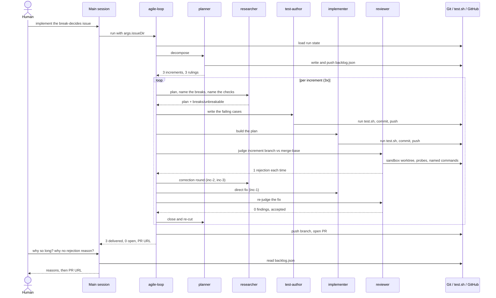

# The named break decides the chain, and the reviewer executes it

## Problem

`agents/researcher.md` already asks the test plan for the fact this issue needs.
Every acceptance criterion gets at least one case that fails when that
criterion's behaviour is broken or removed, each case states the break — the
production change that would make it fail — and a criterion left without such a
case is declared in the plan, with the reason.

That declaration is written and then read by nobody. The workflow triages on
`needsTests` and `checks` alone, so an increment whose criteria no tool can
reach runs exactly the chain of one whose criteria a test catches. Two costs
follow from that, and both have been measured on this repository.

The first is the coverage finding nobody can act on. The reviewer holds every
criterion to the mutation standard and files the ones no test would catch,
without being told which of them the researcher already determined no test
*can* catch. In one measured run eight of nine review rejections were coverage
gaps rather than defects, and correction rounds with nothing to correct cost
12.3 % of the run's subagent spend
(`docs/issues/2026-08-07-second-timeline-run-fixes`). Naming the break in the
plan closed the half of that which was a planning gap. The half that is left is
a reviewer that cannot tell a gap from a criterion no tool reaches, and it pays
for the difference in full correction rounds.

The second cost is that the declaration is trusted in both directions. A named
break is a sentence, and nothing makes it red: a plan that names a break for a
case which would pass anyway earns the same credit as one that names a real
break, and naming one is always the cheaper direction, because declaring a
criterion unbreakable is what routes it out of the ordinary path. A break that
is executed is a measurement. A break that is only written down is a claim by
the role with an interest in the answer.

Two channels bound the shape of the fix. The reviewer reads no run state, so
everything it is told about the criteria reaches it through its prompt. The
workflow reads no file, so everything it steers on reaches it through the
researcher's structured return, beside `needsTests` and `checks` — and that
return is projected into later prompts, so what it carries stays small.

What routing an unbreakable criterion *to* — an adjudicated design decision,
independent attempts compared for variance — is a separate issue and stays out
of this one. This one determines the fact, carries it to the role that acts on
it, and stops the two wrong answers the run gives today: a coverage finding
against a criterion no test can reach, and a break nobody ran.

## Acceptance criteria

- The researcher's structured return names, for every acceptance criterion of
  the increment, whether the test plan named a break for it, and carries that
  break where it named one.
- The workflow carries those criteria and their breaks into the prompt of the
  reviewer that judges the increment as a whole.
- The reviewer does not file the absence of a test for a criterion the
  researcher declared unbreakable.
- The reviewer judges each unbreakable criterion by reading the diff against it,
  and says in its `summary` what it judged and on what.
- The reviewer applies each named break in its sandbox worktree, runs the
  commands its prompt already names, and reports the criterion as verified only
  where that run fails.
- A named break that leaves every one of those commands green is a finding
  against the criterion it was named for.
- An applied break never reaches the checkout and never reaches the diff.
- The run result carries, per increment, every criterion accepted without an
  executable check.
- An increment worked `direct` names no break for any of its criteria, and the
  run result carries all of them as accepted without an executable check.
- `rulebook.md` requires the session to give the human one line naming those
  criteria, for every increment that has any.
- Each rule this adds to a page gets a case in `test-repo.sh` that turns red
  when that rule is removed.
- `bash test.sh` exits 0.

## Retro

Session of 2026-08-16, 09:11–12:04 UTC. One issue, one agile-loop run, three
increments, all delivered, backlog empty, pull request #100 open.

### Rulebook & Process Friction

**The rulebook reports only after the run, and the run took 2h54m.** Step 5
tells the session to name every turned-back increment once the loop returns.
Nothing tells it to say anything while the loop runs, so the human spent the
whole run without a signal and asked for one twice — first why it was taking
so long, then why no rejection reason had been shown. Both answers already
existed in `backlog.json` the moment each review closed. The rule is written
for the end of the run and the run is long enough that the end is too late.
Worth a rule that fires per closed increment, or a progress line the workflow
emits itself.

**The plugin the session ran predates the change the session shipped.** The
loaded plugin was `cea3ceb`, the repository tip newer, and a running session
cannot swap it. The workflow snapshot taken at launch is therefore the
pre-change one: increment 3 shipped a run result that carries every criterion
accepted without an executable check, and this run's own result carries no such
field, so the new rulebook rule — one line to the human per increment naming
those criteria — could not be honoured for the run that created it. Any issue
that changes the loop itself has this property; the retro is where it gets
said, and a fresh session is where it gets verified.

**One rule was breached by the session.** "You may not read the codebase" holds
in Issue Mode, and the first step of the session was a repository-wide `Grep`
for the issue slug. Cost was one tool call and a handful of tokens, so the
damage is nil and the precedent is not: the same reflex on a wider pattern
returns a hundred file paths into the most expensive context in the run. The
issue directory listing that followed answered the question by itself.

The mode was never asked for. The rulebook says to ask once where the human did
not name one; a filed issue with confirmed criteria and a one-word "implement"
made Issue Mode the only reading, and the rulebook's own default is Issue Mode.
No friction, and no ceremony spent — recorded because the rulebook wins where
judgment and page disagree, and here they did not.

### Subagent Efficiency & Delegation

Delegation held. The main session spent 9,267 output tokens over 7 steps and 20
tool calls while 28 subagents spent 1.64M billable tokens over 637 tool calls —
the expensive context stayed almost empty, which is what the split is for. No
research was repeated between the main session and the agents, because the main
session did none.

The redundancy sits between the subagents. Every increment re-entered the same
three files — the workflow, the reviewer page, `test-repo.sh` — through a fresh
researcher, and the test-author role alone read 9.4M cached tokens, more than
any other role. The planner's codemap is what should have absorbed that, and it
carried the file list but not what the previous increment had already learned
about those files' shape.

Thirteen Bash calls across the run were `find "$HOME/.claude/plugins" -path
'*agent-brief/assets*'`: agents locating the backlog recorder before they could
record. That is a fixed path being rediscovered once per agent that writes
state.

### Specification & Planning Quality

No question ended a step, `blockedOnHuman` came back empty, and no ambiguity
surfaced late enough to park the work. The issue's two channel constraints —
the reviewer reads no run state, the workflow reads no file — were stated in
the problem section and both increments that touched them respected them.

Every one of the three increments was rejected once, and the misses cluster in
one place: the cross-cutting criterion that each added rule gets a
`test-repo.sh` case turning red when the rule is removed. Increment 2 shipped a
case that matched a paragraph stating the opposite of its own rule and still
went green; increment 1 lost the fact through the state loader's field list;
increment 3 lost an over-long entry to the index's 500-character cut. All three
are the same failure — a rule believed to be pinned that nothing actually pins
— and the planner folded it back, so increment 3's criteria demand that each
case match only the passage carrying its rule. The loop corrected its own
specification between increments, which is the mechanism working.

The plan was followed. Three rulings are recorded at decompose, including the
cut along the fact's path rather than one increment per criterion, and no agent
deviated from them.

### Token & Latency Optimization

24.4M tokens moved, 1.64M of them billable — cache carried roughly 93 % of the
input. The main session read 1.35M cached tokens against 76 uncached input
tokens.

The spikes are in the test-author and researcher roles, together 64 % of the
token spend. The single most expensive agent was increment 3's test-author at
4.47M tokens over 52 tool calls; the slowest was a reviewer at 20.2 minutes for
one round. `bash test.sh` — eight suites — ran 78 times across the run, and
`test-repo.sh` 141 times, most of them full-suite runs to check one rule's one
case. Latency is dominated by that: the chain is strictly sequential, so every
redundant suite run is on the critical path.

### Tooling & Automation Opportunities

- A suite filter, `bash test.sh --only <suite>`, would cut most of the 78
  full-suite runs down to the one suite the agent is actually iterating on.
- A stable entry point for the backlog recorder would remove 13 `find` calls
  through the plugin cache.
- Mutation probing — delete a paragraph, run the suite, expect red — was
  hand-rolled in a sandbox worktree by three separate agents. It is the same
  loop every time and belongs in a script.
- The workflow should surface each increment's verdict and reason as it closes,
  not only in the final result.

No error was caused by a missing environment prerequisite. Twelve tool calls
failed across 28 agents — six Bash, four Read, one Grep, one Edit — all
recoverable misses, and no agent errored out.

### Session Metrics Summary

| Metric | Value |
| --- | --- |
| Wall clock (loop) | 2 h 54 m |
| Subagents | 28 (0 errors, 0 skipped) |
| Increments delivered / open | 3 / 0 |
| Correction rounds | 3 (one per increment) |
| Review findings filed / open | 3 / 0 |
| Tool calls (subagents) | 637 |
| Tool calls (main session) | 20 |
| Billable subagent tokens | 1,639,443 |
| Tokens incl. cache reads | 24,406,453 |
| Main-session output tokens | 9,267 |
| Full-suite `test.sh` runs | 78 |
| `test-repo.sh` runs | 141 |
| Questions to the human | 0 |

### Per-Agent Breakdown

| Agent | Runs | Tokens (incl. cache) | Share | Tool calls | Failed | Minutes |
| --- | --- | --- | --- | --- | --- | --- |
| main session | 1 | 1,563,677 | — | 20 | 0 | — |
| test-author | 5 | 9,379,264 | 38.4 % | 161 | 2 | 31.8 |
| researcher | 5 | 6,277,568 | 25.7 % | 152 | 2 | 44.1 |
| reviewer | 6 | 3,962,731 | 16.2 % | 119 | 5 | 55.4 |
| implementer | 6 | 3,010,358 | 12.3 % | 135 | 1 | 29.4 |
| planner | 4 | 1,233,362 | 5.1 % | 54 | 3 | 8.9 |
| general-purpose (state load, push/PR) | 2 | 543,170 | 2.2 % | 16 | 0 | 2.9 |

### Mermaid Sequence Diagram

