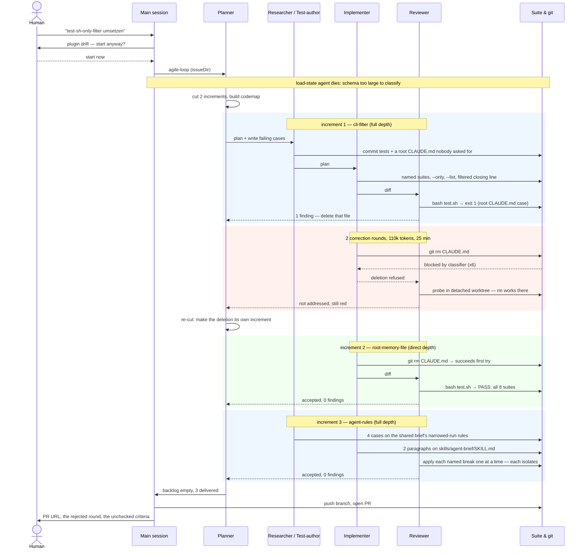

# `test.sh` runs the suite you name

## Problem

`test.sh` is the one command behind "the suite is green", and it has exactly
one mode: it runs all eight suites, one after another, every time. A run that
only needs `test-repo.sh` still pays for two shell suites, three `node --test`
suites and three `npm test` invocations.

The bill has been measured on the run that shipped
`docs/issues/2026-08-16-the-break-decides-the-chain`. That run invoked the full
`test.sh` 78 times and `test-repo.sh` 141 times, across 28 subagents in 2 h
54 min of strictly sequential wall clock. Most of those invocations were
mutation probes: delete one paragraph from an agent page, run the suite, expect
red, restore. Such a probe can only ever turn `test-repo.sh` red — every other
suite in the list is untouched by an edit to a markdown page and runs purely as
overhead, and it runs on the critical path, because no two agents in the chain
run at the same time.

The reviewer's probing is not the only caller. A test-author iterating on one
grep pattern re-runs the same eight suites until the pattern sits, and so does
an implementer fixing one case.

What makes this more than a speed problem is the answer a filtered run gives.
Today the closing line of a green run is `PASS: all 8 suites`, and every agent
reports it as the fact that the suite is green. A filter that keeps that line
hands every agent a way to call a change green having run an eighth of the
evidence — and the mutation standard the repository runs on rests on exactly
that fact being true. So the filter has to be visibly a filter, in its own
output and in the rules the agents follow, or it buys latency by weakening the
one measurement the chain trusts.

Selecting a suite also needs something to select it by. The list carries prose
labels — "the repository itself", "parallel runs: worktrees",
"skills/agent-brief/assets: the backlog recorder" — which are written to be read
in output, not typed on a command line.

Speeding up the mutation probe itself — the delete, run, expect-red, restore
loop three agents hand-rolled separately in that run — is a separate issue and
stays out of this one.

## Acceptance criteria

- `bash test.sh` with no arguments runs every suite and prints what it prints
  today.
- Every suite carries a short stable name that a caller can type, and no two
  suites share one.
- `bash test.sh --only <name>` runs that suite alone and no other.
- `--only` given more than once runs each named suite and no other, in the
  order the suite list declares them.
- `bash test.sh --list` prints every suite's name and exits 0 without running a
  suite.
- A name that matches no suite makes the run exit non-zero, print the unmatched
  name and print the names that do exist, and run no suite at all.
- A filtered run never prints the wording an unfiltered green run ends with, and
  its closing line names how many of the repository's suites it ran and that it
  was filtered.
- A filtered run whose suites all pass exits 0, and a filtered run with a
  failing suite exits non-zero.
- Adding a suite to `test.sh` requires giving it a name, and a suite without one
  makes a case turn red.
- The rules the agents follow state that a filtered run is not the fact that the
  suite is green, and that the run an agent commits, reports or takes a verdict
  from is the unfiltered one.
- Every rule this adds to a page gets a case in `test-repo.sh` that turns red
  when that rule is removed, and each such case matches only the passage
  carrying its rule.
- The behaviour of every criterion above is covered by cases that turn red when
  that behaviour is removed.
- `bash test.sh` exits 0.

## Retro

The run delivered three increments in one loop: the `--only` filter, the
removal of a repository-root `CLAUDE.md` the run itself had created, and the
agent rules that say a narrowed run is not a green suite. 18 commits, 5 files,
+1143/-34. One increment was rejected on first review and took two correction
rounds without being fixed; the fix became increment 2.

### Rulebook & Process Friction

**Which process rule or automated hook created disproportionate friction?**

The test-author's rule to keep the suite doc — "the `CLAUDE.md` beside the
tests" — current in the same commit as the tests. The suite it wrote for this
issue lives in `test-repo.sh` at the repository root, so the rule read as
"write a `CLAUDE.md` at the repository root", and commit 2640507 did exactly
that, 86 lines of it. `test-repo.sh:176` has forbidden a root memory file for
as long as the case has existed, because such a file loads as project memory
into every subagent. The rule and the case contradict each other for any suite
that sits at the root, and nothing in either page says which wins.

The bill: `bash test.sh` went red on a case no criterion of the increment
touched, the increment was rejected, two correction rounds failed to fix it,
and the planner had to cut a whole extra increment whose entire content was
`git rm CLAUDE.md`. That detour cost 198,545 subagent tokens (23.6% of the run)
and 38 of 137 minutes of strictly sequential agent time — for one file that
should never have been written.

The second friction was the permission classifier, and it is not the
repository's. Six identical deletion attempts (`git rm CLAUDE.md`, `rm
/home/user/uroboros/CLAUDE.md`, both with and without `-C`) were denied inside
the two correction rounds with "Blocked by classifier". The same `git rm
CLAUDE.md` succeeded on the first try in increment 2, in a fresh agent whose
whole brief was the deletion. The command did not change; its surrounding
context did. An agent cannot route around that, and the loop only escaped it
because the planner is allowed to re-cut.

**Where did the agent apply rules too rigidly or incorrectly, causing
unnecessary overhead?**

The reviewer of correction round 1 ruled the block was "an agent-side
reluctance and not a repository or permission constraint", having proved in a
detached worktree that `rm CLAUDE.md` works there. The evidence was real and
the conclusion was wrong: the denial was a classifier decision that the
sandbox path did not reproduce. The ruling sent the loop into a second
correction round that could not succeed either — one implementer round and one
reviewer round, 58,461 tokens, 11 minutes, for a conclusion already on record.
The implementer was right both times and said so plainly; nothing in the
correction round lets a repeated "this is blocked" end the round differently
from the first one.

The implementer's own ruling in round 1 — leaving the file rather than
emptying, renaming or moving it, "because the finding asked for deletion and
every substitute is a change no finding named" — was correct and is what kept
the tree clean for the increment that did fix it.

The main session spent one of the human's steering points on something that is
not one of the three: the SessionStart warning about the outdated plugin
(0f361df against tip b47efdf) made it ask whether to start the loop at all.
The answer was "start now", and no drift-caused defect appeared in the run.

### Subagent Efficiency & Delegation

**Did delegating to subagents conserve context, or was the briefing overhead
larger than the gain?**

Delegation held. The main session produced 5,764 output tokens over 14 tool
calls and 4 steps across 3 h 31 min, read no production file and ran no git
operation beyond this retro; the 20 subagents produced 842,751 tokens over 368
tool calls. The whole 1,143-line change was written in context the main session
never held. Its own 691,148 tokens are 71% cache reads of a standing context
that sat idle while the loop ran.

**Were there redundancies or repeated research between the main conversation
and subagent runs?**

None between the main session and the loop — the main session never entered the
codebase. Inside the loop there is one clear repeat: the root-`CLAUDE.md`
finding was researched three times, once per reviewer round, each time
re-establishing which case fails, which commit added the file, and whether
anything mechanically guards the path. Review rounds 1 and 2 wrote reproductions
that agree line for line. The reviewer of round 2 declined to re-apply the nine
named breaks because the fix diff touched only `backlog.json`, which is exactly
the saving that should have applied to the finding itself.

### Specification & Planning Quality

**Were all critical requirement gaps uncovered upfront, or did ambiguities
surface late?**

The issue file held. All thirteen criteria survived to the end unamended, no
agent filed a question, and nothing was escalated to the human — `blockedOnHuman`
never fired. The one thing the spec did not anticipate was not a gap in the
criteria but in the environment: no criterion asked for a `CLAUDE.md`, and the
file appeared anyway.

The planner's cut was good. It opened with two increments, and the depth
classification paid: `root-memory-file` ran at `direct` depth — implementer and
reviewer only, no researcher, no test-author — and closed in 57,647 tokens and
10.4 minutes with zero findings. Cutting the deletion out as its own increment,
rather than looping the filter increment a third time, is what ended the
deadlock.

**Was the architecture plan strictly followed, or were there unauthorized
deviations?**

One deviation, and it is the whole story of this run: the 86-line root
`CLAUDE.md`, written by the test-author, named in no plan and asked for by no
criterion. Everything else followed. The named breaks were applied one at a
time and each turned exactly its own case red; increment 3's four breaks were
verified individually, including the deliberate check that restating the rule
on a second page turns its case red.

### Token & Latency Optimization

**Where did token spikes, redundant tool loops, or uncompacted outputs occur?**

Three spikes. `tests:cli-filter.0` is the largest single agent of the run at
120,868 tokens over 78 tool calls in 17.2 minutes — it built temp copies of
`test.sh` with `declare_suites()` swapped for stubs, which is the right
technique and an expensive one. `review:cli-filter.0` cost 85,331 tokens and
20.2 minutes, the longest wall clock. `research:agent-rules.0` cost 88,704
tokens to plan an increment whose production diff is two paragraphs of prose on
one page — the most lopsided research-to-diff ratio in the run.

The run is strictly sequential: 137 minutes of agent time in a 137-minute
workflow, no two agents overlapping. Every minute saved is on the critical
path, which is the premise of this issue.

**How efficient was context cache utilization across steps?**

For the main session, 489,415 cache reads against 194,524 cache creations and
1,445 fresh input tokens — a 71% read share, and the session never recompacted.
Subagents each start cold by construction, so the run's cache economy is
dominated by the 20 fresh contexts, not by reuse.

The measurable win is the issue's own subject. The run made 97 suite
invocations. Before increment 1 landed, every one was a full eight-suite run;
after it, 51 of them used `--only` and 17 called `test-repo.sh` directly,
leaving 29 full runs — most of them the mandatory closing green. The feature
paid for itself inside the run that built it.

**Which errors were caused by missing environment pre-requisites?**

None. No test needed an unmet prerequisite, and no suite failed to start. 15
tool calls returned errors across 368, all ordinary and self-corrected; 7 were
the deletion denials. The one hard failure was infrastructural: the workflow's
`load-state` agent died with "blocked by safety classifier: output schema too
large to classify safely" — 1 of 20 agents, and the run continued without it
because the state was fresh.

### Tooling & Automation Opportunities

**Which recurring manual steps should become CLI tools or scripts?**

1. **The mutation probe.** Three agents hand-rolled delete-a-line, run the
   suite, expect red, restore — increment 3's reviewer did it five times by
   hand. The issue names this as out of scope and it stays a separate issue; the
   evidence for it is now stronger, and with `--only` a probe runner can narrow
   to the one suite that can turn red.
2. **A finding that survives a round unfixed should not be re-researched.** The
   reviewer already skips re-applying breaks when the fix diff touches nothing
   it judges; the same test should let it re-file a finding by reference instead
   of rebuilding its reproduction. That alone would have saved a round.
3. **A repository guard against writing a root memory file**, so the test-author
   is stopped at the write instead of at the suite. The barrier hook already
   exists for reads.

**Which rules should change?**

The test-author's suite-doc rule needs a stated exception for a suite at the
repository root, naming where that doc goes instead. Increment 3's reviewer
noted the same hole from the other side: deleting the root `CLAUDE.md` removed
the only written record of the root shell suites' conventions, which now live
nowhere but the scripts.

### Session Metrics Summary

| Metric | Value |
| :--- | :--- |
| Wall clock, session | 3 h 31 min (2026-08-17 16:11 → 19:42 UTC) |
| Wall clock, loop | 2 h 17 min, strictly sequential |
| Main-session tokens | 691,148 (in 1,445 / out 5,764 / cache read 489,415 / cache create 194,524) |
| Subagent tokens | 842,751 |
| Total tokens | 1,533,899 |
| Agents | 20 (19 done, 1 error) |
| Tool calls | 14 main + 368 subagent (15 errors, 7 of them permission denials) |
| Thinking blocks, subagents | 195 |
| Increments | 3 delivered, 0 open, 1 rejected on first review |
| Correction rounds | 2, both unable to apply their only fix |
| Commits / diff | 18 commits, 5 files, +1143 / -34 |
| Suite invocations | 97 (29 full `test.sh`, 51 `--only`, 17 `test-repo.sh`) |
| Escalations to the human | 0 from the loop; 1 question from the main session (plugin drift) |
| Cost of the root-`CLAUDE.md` detour | 198,545 tokens (23.6%), 38 min (28%) |

### Per-Agent Breakdown

| Agent | Type | Tokens | Tool calls | Minutes |
| :--- | :--- | ---: | ---: | ---: |
| main session | — | 691,148 | 14 | 211 |
| load-state | general-purpose | — | — | error |
| decompose | planner | 30,564 | 16 | 2.5 |
| research:cli-filter.0 | researcher | 68,013 | 22 | 9.6 |
| tests:cli-filter.0 | test-author | 120,868 | 78 | 17.2 |
| implement:cli-filter.0 | implementer | 46,610 | 20 | 6.3 |
| review:cli-filter.0 | reviewer | 85,331 | 36 | 20.2 |
| implement:cli-filter.1 | implementer | 18,914 | 11 | 4.7 |
| review:cli-filter.1 | reviewer | 32,858 | 15 | 6.9 |
| implement:cli-filter.2 | implementer | 18,807 | 9 | 4.3 |
| review:cli-filter.2 | reviewer | 39,654 | 15 | 9.6 |
| replan:cli-filter | planner | 35,530 | 12 | 3.0 |
| implement:root-memory-file.0 | implementer | 20,561 | 11 | 5.4 |
| review:root-memory-file.0 | reviewer | 37,086 | 17 | 5.0 |
| replan:root-memory-file | planner | 30,665 | 10 | 2.3 |
| research:agent-rules.0 | researcher | 88,704 | 28 | 6.7 |
| tests:agent-rules.0 | test-author | 40,634 | 23 | 5.4 |
| implement:agent-rules.0 | implementer | 20,565 | 11 | 7.0 |
| review:agent-rules.0 | reviewer | 39,889 | 16 | 17.2 |
| replan:agent-rules | planner | 16,803 | 5 | 0.6 |
| publish | general-purpose | 50,695 | 13 | 2.3 |

### Interaction Flow

